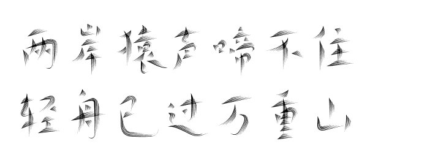

# SunHao's Github Blog

# PS-Genius

<!--  -->

  

  

#

#

> 欢迎，这里是一名纯粹的工程师，geek 的网站
>
> 我住在天朝的帝都， 有条叫做 Jack 的狗

<!-- 如果你想造一艘船
不要老催人去采木
忙着分配工作
和发号施令。
而是要激起他们
对浩瀚无垠的
大海的向往。
If you want to build a ship,
don't drum up the people to gather wood,
divide the work, and give orders.
Instead, teach them to yearn
for the vast and endless sea. -->

<!-- 👉只有妳想不到的
👉沒有妳玩不到的
👉午夜必備神器
👉激情互動♥
👉共享資源😍
👉java，python，c++應有盡有類型齊全
👉全棧工程，傳統寫bug，海到晚上睡不著♥
👉🌐https://sunhao1024.github.io
👉快來體驗壹下吧
👉有頭髮勿入
---print(Hello world)-- -->

# [Click it!](https://sunhao1024.github.io)
